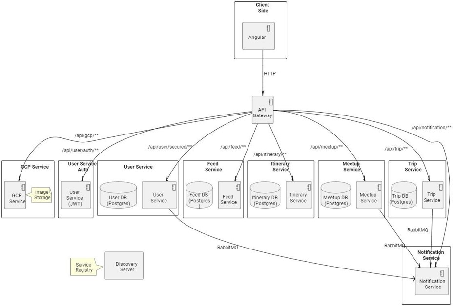

# LocaleConnect Project Documentation


## Description

LocaleConnect envisions being the ultimate gathering spot for travelers, akin to how LinkedIn connects professionals. It serves as a vibrant community where travel enthusiasts and local experts exchange experiences, recommend the best spots to visit in cities or countries, encourage one another, and meet fellow travelers during their explorations.

## Project Design



## Repository Cloning

1. **Clone the Repository**: `https://github.com/MoetazKhelil/Local-eConnect.git`

## Backend Setup Guide for LocaleConnect

### Installation
- Java JDK 17
  - To install Java JDK 17, follow these steps:
    1. Visit the official Oracle website or adopt OpenJDK to download and install Java JDK 17 based on your operating system.
    2. Set up `JAVA_HOME` environment variable pointing to the JDK installation directory.

- Maven
  - To install Maven, follow these steps:
    1. Visit the Apache Maven website to download the latest version of Maven.
    2. Follow the installation instructions provided for your operating system.
    3. Ensure that Maven is added to your system `PATH`.

- IDE (IntelliJ IDEA, Eclipse, or Spring Tool Suite)

## Running the Backend with Docker
- Install Docker Desktop
- Run Docker Desktop in your machine
- Navigate to the `/LocaleConnectBackend` directory
- Run

  ``` 
  docker compose -f docker-compose-test.yml up
  ```
## Troubleshooting

### Issue: Problems Running Containers and Starting Apps

If you encounter issues with running containers or starting applications within our project, it is essential to verify that your system meets the minimum hardware requirements. Given the large-scale nature of our project, which utilizes a microservice architecture, sufficient hardware resources are crucial for optimal performance.


## Unit Testing
- Navigate to the `/LocaleConnectBackend` directory
- Run 
  ``` 
   mvn clean test
   ```


## Frontend Setup Guide for LocaleConnect

### Installation

Navigate to the `/LocaleConnectBackend` directory

- Node.js (version 10.2.4)
  - Visit the official Node.js website to download and install Node.js version 10.2.4.

- Angular CLI (version 15.0.0)
  - Install Angular CLI globally by running the following command in your terminal:
    ```
    npm install -g @angular/cli@15.0.0
    ```

- Angular Material
  - Angular Material can be installed via npm. Run the following command in your project directory to install Angular Material:
    ```
    npm install @angular/material
    ```

## Running the App
- Ensure that all Docker containers hosting the services run successfully and all apps started before proceeding

- Navigate to the `/LocaleConnectBackend` directory
  
- Run

  ```
  npm install
  ```

- Run
  ```
  ng serve
  ```
- Open `http://localhost:4200/` in your browser

## App Testing Instructions

To test the application, you have two options:

1. **Registering New Users**: This involves inputting user details to create new accounts, then logging in the accounts which then allows for various interactions within the platform, such as:
  - Following other users to view their posts
  - Creating posts and attaching images
  - Liking or commenting on posts from followed users
  - Rating local guides, trips etc..
  - Participating in trips, itineraries , meetups
  - And more...

2. **Using Test Credentials**: For a quick overview of pre-set features and interactions, log in using the following test credentials:
  - **Email**: jbianchi@test.com
  - **Password**: mypassword

***Remark***: After logging in, to access the home page and load posts, you may need to click on another tab within the app and then return to the home tab to ensure all posts are loaded. Similarly, for other tabs, a refresh or tab switch may be required to view all available data effectively.


## Azure Deployment
**Current Status:** Our database has been successfully deployed on Azure, marking a pivotal first step in our cloud migration. We are actively working on deploying the remaining services to Azure.

## Code Structure

Most services include the following key components:

- **Controller**: Acts as the entry point for incoming requests. It routes these requests to the appropriate services and returns responses to the client.

- **Service**: Contains the business logic of the microservice. It processes the data received from the controllers, interacts with the repositories, and performs the necessary operations.

- **Repository**: Interfaces with the database to retrieve, update, or delete data. It abstracts the data layer, allowing services to interact with the database without direct SQL queries.

- **Model**: Defines the data structure and its relationships. These are the entity classes that represent tables in the database.

- **DTO (Data Transfer Object)**: Used to transfer data between processes. DTOs help in optimizing network calls by transferring only the necessary data.

- **Mapper**: Facilitates the conversion between DTOs and entities. This is essential for separating the external data structure from the internal model representation.

- **Error Handler**: A global component to catch and handle exceptions thrown across the service. It ensures that all errors are caught and appropriately formatted before sending the response to the client.

- **Exception**: Custom exceptions specific to the microservice. These exceptions are used to handle specific error cases gracefully.

- **Response Handler**: Customizes the API responses, ensuring consistency across the service. It wraps the responses in a standard format, making it easier for clients to parse.

- **Rabbit (RabbitMQ)**: Manages asynchronous communication between microservices. It decouples service dependencies, improving fault tolerance and scalability.

- **Config**: Contains configuration settings for the microservice. This includes database configurations, RabbitMQ settings, and other service-specific configurations.

- **Test**: Ensures the reliability and functionality of the microservice. Each service has a `ControllerTest` class for testing the endpoints via MVC controller testing and a `ServiceTest` class for unit testing the business logic.


## Services

### API-Gateway

The API-Gateway acts as the centralized entry point for all client requests, routing them to the appropriate microservice while handling cross-cutting concerns like authentication, logging, and SSL termination. It is implemented using Spring Cloud Gateway, providing dynamic routing, monitoring, resiliency, and security.

- **Base URL**: `http://localhost:8080`

### Discovery Service

Implemented with Spring Eureka, the Discovery Service allows services to register themselves and to discover other services to communicate with, enabling load balancing and a more dynamic architecture.

### User Service

*Postman Documentation Link is provided in the next section.*

*Note that the **Base URL**: `http://localhost:8080` has to be added as a prefix for all endpoints.*

- **Endpoints**:
  - Registration for Travelers: `POST /api/user/auth/register-traveler`
  - Registration for Local Guides: `POST /api/user/auth/register-localguide`
  - Login/Logout capabilities: `POST /api/user/auth/login`
  - Follow a user: `POST /api/user/secured/{followerId}/follow/{userId}`
  - Unfollow a user: `POST /api/user/secured/{followerId}/unfollow/{userId}`
  - Update user profile: `PUT /api/user/secured/update`
  - Delete user: `DELETE /api/user/secured/delete/{userId}`
  - Rate a Local Guide: `POST /api/user/{guideId}/rate/{travelerId}`
  - List all Local Guides: `GET /api/user/guides`
  - View profile: `GET /api/user/{userId}/profile`
  - View followers: `GET /api/user/{userId}/followers`
  - View following: `GET /api/user/{userId}/following`

### Trip Service

- **Endpoints**:
  - Create a Trip: `POST /api/trip/create`
  - List all Trips: `GET /api/trip/all`
  - Get Trip by ID: `GET /api/trip/{trip_id}`
  - Update a Trip: `PUT /api/trip/update/{trip_id}`
  - Delete a Trip: `DELETE /api/trip/delete/{trip_id}`
  - Search for a Trip: `GET /api/trip/search`
  - Filter Trips: `GET /api/trip/filter`
  - Attend a Trip: `POST /api/trip/{id}/attend`
  - Unattend a Trip: `POST /api/trip/{id}/unattend`
  - Rate a Trip: `POST /api/trip/{tripId}/rate/{userId}`

### Itinerary Service

- **Endpoints**:
  - Create an Itinerary: `POST /api/itinerary/create`
  - Update an Itinerary: `PUT /api/itinerary/update/{id}`
  - Delete an Itinerary: `DELETE /api/itinerary/delete/{id}`
  - Get Itinerary by ID: `GET /api/itinerary/{id}`
  - List all Itineraries: `GET /api/itinerary/all`
  - Attend an Itinerary: `POST /api/itinerary/{id}/attend`
  - Unattend an Itinerary: `POST /api/itinerary/{id}/unattend`
  - Search Itineraries: `GET /api/itinerary/search`
  - Filter Itineraries: `GET /api/itinerary/filter`

### Meetup Service

- **Endpoints**:
  - Create a Meetup: `POST /api/meetup/create`
  - Update a Meetup: `PUT /api/meetup/update/{id}`
  - Delete a Meetup: `DELETE /api/meetup/delete/{id}`
  - Get Meetup by ID: `GET /api/meetup/{id}`
  - List all Meetups: `GET /api/meetup/all`
  - Attend a Meetup: `POST /api/meetup/{id}/attend`
  - Unattend a Meetup: `POST /api/meetup/{id}/unattend`
  - Search Meetups: `GET /api/meetup/search`

### Feed Service

- **Endpoints**:
  - Create a Post: `POST /api/feed/create`
  - Delete a Post: `DELETE /api/feed/delete/{postId}`
  - Add a Comment: `POST /api/feed/{postId}/comment`
  - Delete a Comment: `DELETE /api/feed/{postId}/comment/{commentId}`
  - Like a Post: `POST /api/feed/{postId}/like`
  - Unlike a Post: `POST /api/feed/{postId}/unlike`
  - Get Post by ID: `GET /api/feed/{postId}`
  - Get Posts by Author ID: `GET /api/feed/author/{authorId}`
  - Search Posts: `GET /api/feed/search`
  - Filter Posts: `GET /api/feed/filter`

### Notification Service

- **Endpoints**:
  - Get Notifications: `GET /api/notification/notify/{userId}`

### GCP Storage Service

- **Endpoints**:
  - Upload File: `POST /api/gcp/`
  - Read File: `GET /api/gcp/`

### Security

We utilized JWT for authentication. Authentication is implemented within the User Service. Access to services is managed through the API-Gateway after successful login.

## Contributors

This project is brought to life by the dedication and expertise of Moetaz Khelil, George Elfayoumi and Maha Marhag.


## Postman Documentation

[View Postman Documentation](https://www.postman.com/cloudy-shadow-750794/workspace/new-team-workspace/overview)

